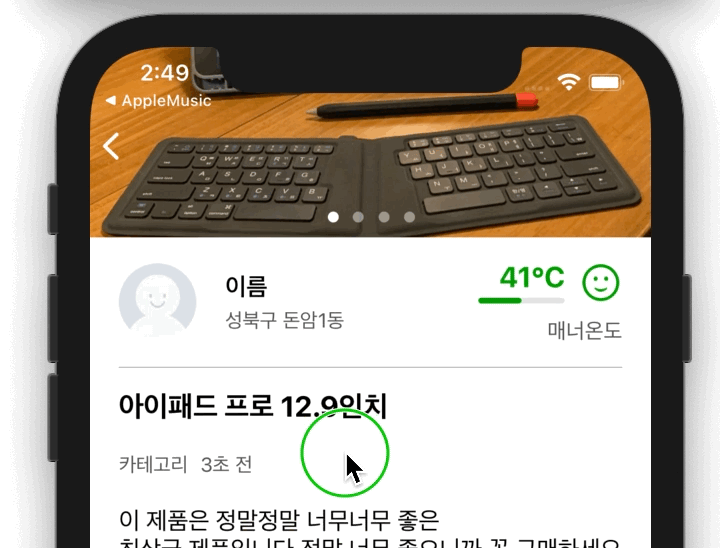

## wonseok🙋🏽‍♂️ Danggn I Learned(DIL)

# 종합👏🏼 
### `2주차에서 보완 한 부분`
* ~~세그먼트의 글씨체와 selector의 두께 조정~~
* ~~ProductDetail 뷰 컨트롤에서 하단부에 CollectionView 구현~~
* ~~메인뷰에 플로팅 버튼 추가~~

### `최종 결과물에서 보완하지 못한 부분 - 앞으로 배워가야 할 것들`
* 좌우 스와이프로 세그먼트 뷰 전환이 가능하게 하기
* 지역 선택 popover 부분 다른 방법으로 더 똑같이 구현 할 수 있지 않을까?
* ProductDetail 뷰 컨트롤에서 사진의 상단 부분에 명암 효과 필요
    * 상단 버튼이 흰색이어서 제품 사진이 흰 계열이면 버튼이 안보임
    * 따라서 명암 효과가 필요함
    
# 당근마켓을 클론코딩하면서 참고한 자료🥕 

## 📌 Popover

`Solution 1`-난 이 방법 사용
* [버튼 누르면 Popover나오게 하는 방법](https://slicode.com/how-to-show-popovers-in-ios-swift/)
* [Popver안에 테이블 뷰 집어넣기](https://slicode.com/show-tableview-inside-popover/)
* [Popover로 띄운 테이블 뷰 셀 클릭하여 라벨의 값 변경하기](https://slicode.com/handle-selection-of-tableview-present-in-popovercontroller/)

`Solution 2`
* [Poover구현](https://www.ralfebert.de/ios-examples/uikit/choicepopover/)

`📲`

## 📌 Segment
* [Segment-Container View사용하기](https://stackoverflow.com/questions/43512442/switch-the-sub-viewcontroller-use-segmented-control/43513446)
* [Segue를 통한 뷰 컨트롤러 전환과 데이터 교환 방법](https://soooprmx.com/archives/8873)

## 📌 Segment Custom

`Solution 1`
* [Segment Custom 오픈 소스](https://github.com/Code-With-Coffee/CustomSegmentedControl)
* [위 자료를 이용한 유튜브 자료](https://www.youtube.com/watch?v=dOSoijHZo5Y&list=PLgOlaPUIbynoQIcChkQXuGEPXf0Rl8ImH&index=2&t=1185s)

`Solution 2 - 유진`
* [TabBar를 이용한 Custom](https://baked-corn.tistory.com/111?category=718235)
* [TabBar Custom을 하여 뷰 전환하기-좌,우측 슬라이드를 통해](https://baked-corn.tistory.com/113?category=718235)

`📲`

## 📌 HeaderView Custom
* [스크롤 땡기면 늘어나는 HeaderView](https://medium.com/@Anantha1992/stretchable-header-view-in-uicollectionview-swift-5-ios-a14a25dcd383)

## 📌 Navigation Bar Custom

`📲`

* 
* [UINavigationBarAppearance](https://zeddios.tistory.com/864)
* [NavigationBar 속성을 이용한 커스텀](https://zeddios.tistory.com/574)
* [standard / compact / scrollEdge Appearance](https://zeddios.tistory.com/861)

## 📌 Floating Button

* [플로팅 버튼](https://swieeft.github.io/2020/03/21/FloatingButton.html)

`📲`

## 📌 당근마켓 구버젼 최상단 헤더뷰 스스륵 사라지는 거 구현

* [유뷰브 자료](https://www.youtube.com/watch?v=y7enrwW7C4E&t=768s)
* [갓택오버플로우 자료](https://stackoverflow.com/questions/25263343/how-to-change-alpha-value-along-with-scrolling)
* ### 개인적인 팁
`일단 나도 두번째 링크의 코드를 토대로 값을 이렇게도 해보고 저렇게도 해봤는데..결국에는 참조 링크의 코드에서 좀 변형이 되긴 했다.`

* 사라지게 하고 싶은 헤더뷰의 Height값을 Outlet-Constraint로 지정하고 진행
* 헤더뷰가 휴대폰의 상태바를 지나치며 사라지게 하고 싶다면?
* 스크롤 화면을 구성하는 전체 뷰(스크롤뷰, 테이블 뷰, 컬렉션 뷰)의 AutoLayout-top과
* 사라지게 할 Header view의 AutoLayout-top을 superview에 걸어둬야 하고, 이때 헤더뷰 내부의 버튼과 같은 요소들은 AutoLayout을 잡을 때 top을 제외하고 잡아줘야 상태바를 거쳐 지나간다.

`📲`

## + 디테일 뷰 구현한 거 추가

`상단 네비 바의 구현이 뭔가 이상하게 안돼서 방법을 알게되면 추가할 예정!-추가완료`

* [UIView 원하는 부분만 Border 주기](https://devsc.tistory.com/62)
