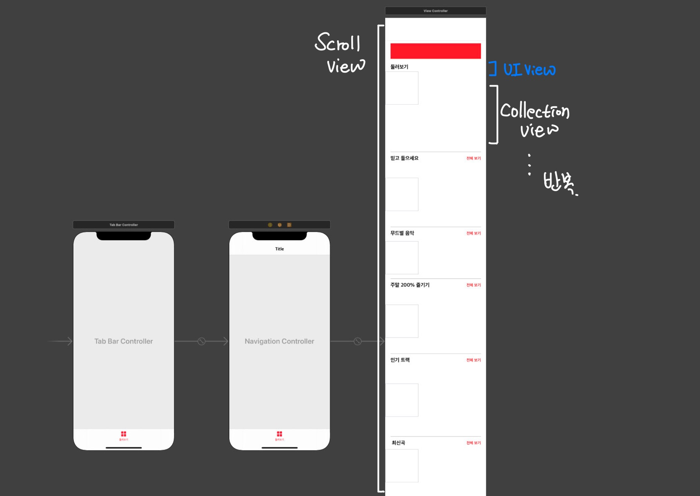
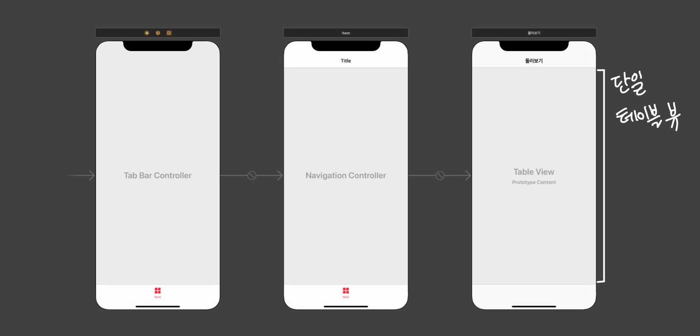
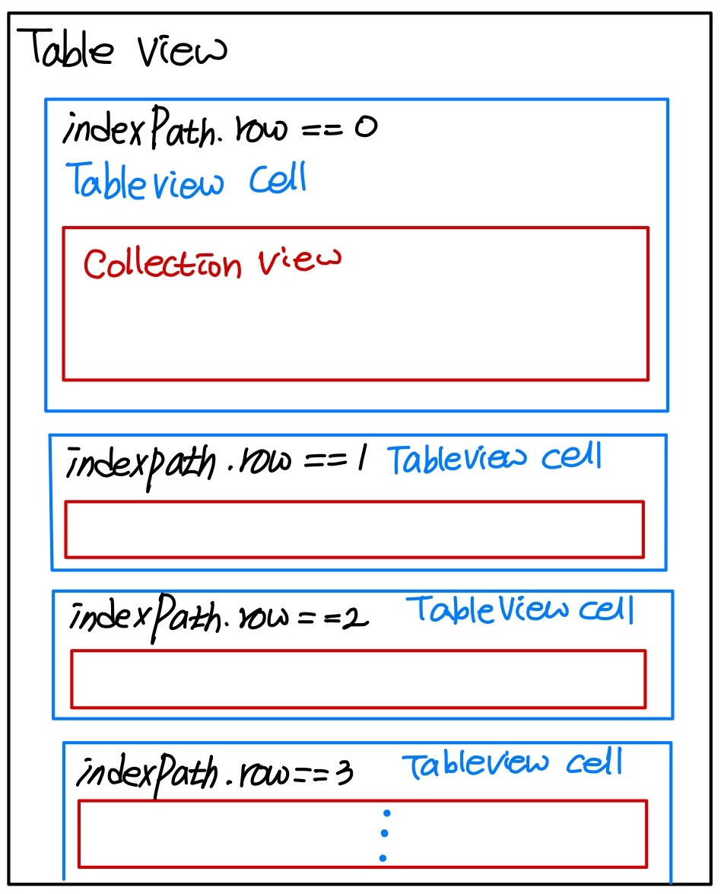

## wonseok🙋🏽‍♂️
# Apple Music 둘러보기 탭 클론 1주차

### `2주차에서 구현한 기능`
* 완성도 높이기

---

1주차에서 뷰의 구조를 완전히 바꿨다.
좌측이 변경 전 Storyboard이고 우측이 변경 후의 Storyboard이다.

한 눈에 봐도 굉장히 단순해진 것을 알 수 있다.

처음에는 사진에도 나와있지만 전체를 감싸는 스크롤 뷰 위에 UIView+CollectionView 조합으로 계속 반복되는 뷰의 구조였다.

하지만 그렇게 되면 스크롤이 길어질 수록, 수직 스크롤에 대해서는 컬렉션이나 테이블뷰가 아니기 때문에 좋지 못한 구조가 될 것이라고 생각했다.

그래서 새롭게 알게 된 방법으로 뷰를 뜯어고치게 되었다.

스크롤 뷰 대신 테이블 뷰로 전체를 감싸고 그 안에서 섹션을 나누어 진행하였다.

대충 이런 구조라고 생각하면 된다.

### `내가 구현한 화면 📲`

### `고찰`
이번 클론에서 개인적인 목표?는 코드의 구조를 공부하는거였다. 당근마켓이 끝나고 난 뒤 너무 뒤죽박죽이던 코드를 보고 생긴 목표였는데.. 1주차 발표 시간에 다른 스터디원의 코드를 통해 테이블 뷰 안에 컬렉션 뷰를 넣어서 보다 가벼운(?) 앱 구조를 구성할 수 있다는 것을 알게 되었다. 
2주차에는 이러한 방법을 적용하여 테이블 뷰, 컬렉션 뷰를 통해 다시 뷰를 구성해보고자 한다.
