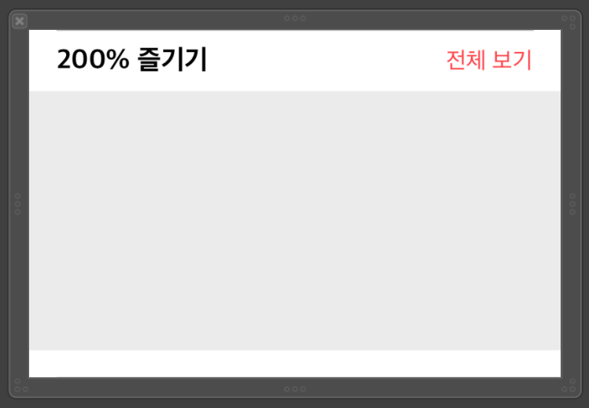
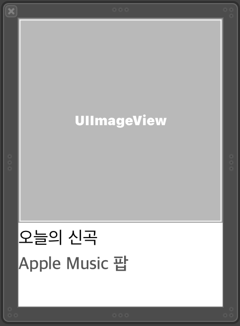

## wonseok🙋🏽‍♂️
# Apple Music 둘러보기 탭 클론 2주차

### `2주차에서 구현한 기능`
* 완성도 높이기


1주차에서 뷰의 구조를 완전히 바꿨다. 좌측이 변경 전 Storyboard이고 우측이 변경 후의 Storyboard이다.


한 눈에 봐도 굉장히 단순해진 것을 알 수 있다.  
처음에는 사진에도 나와있지만 전체를 감싸는 스크롤 뷰 위에 UIView+CollectionView 조합으로 계속 반복되는 뷰의 구조였다.  
하지만 그렇게 되면 스크롤이 길어질 수록, 수직 스크롤에 대해서는 컬렉션이나 테이블뷰가 아니기 때문에 좋지 못한 구조가 될 것이라고 생각했다.  


그래서 새롭게 알게 된 방법으로 뷰를 뜯어고치게 되었다.  


스크롤 뷰 대신 테이블 뷰로 전체를 감싸고 그 안에서 섹션을 나누어 진행하였다.  
테이블 뷰와 컬렉션 뷰만을 이용하기 때문에 재활용이 가능하며, 뷰가 load될 때. 화면에 보이는 것만 load되기 때문에 실제로 시뮬레이터를 돌려보아도 조금 덜 버벅이는 듯한 느낌을 받았다.(기분탓인가..?). 


대충 이런 구조라고 생각하면 된다. TableView Cell을 Xib파일로 만들어 주었고 TableView Cell안에 들어 갈 CollectionView Cell 또한 Xib로 만들어 주었다.  



가운데 사진의 회색 부분이 CollectionView이며 그 CollectionView에 들어갈 Cell이 우측이다.


이쯤되면 어느정도 전체적인 구조는 이해가 된 것 같다.


조금 더 세세하게 들어가보자.

### `MainViewController.swift`

UITableViewDataSource, UITableViewDelegate 프로토콜을 가진다.   
UITableViewDataSource 내부에서 몇개의 섹션을 나눌건지(Cell의 갯수) 정하고  
if문을 통해 분기 처리하여 아래와 같이 해당 TableViewCell이 어떤 Cell인지 지정해준다.  
```swift
// MARK: -MainViewController
if(indexPath.row == 0) {
    guard let cell = tableView.dequeueReusableCell(withIdentifier: ExploreTableViewCell.identifier) as? ExploreTableViewCell else{
        return UITableViewCell()
    }
    //table view cell 내의 collection view에게 데이터 전달
    let rowArray = firstArray.objectsArray
    cell.updateCellWith(row: rowArray) 
    
    return cell
``` 


### `TableViewCell.swift`

현재 TableView Cell에서 사용할 CollectionView Cell을 지정해준다.  
UICollectionViewDelegate,UICollectionViewDataSource 프로토콜을. 가진다.   UICollectionViewDelegateFlowLayout 또한 이곳에서 설정해주면 된다.  


### `CollectionViewCell.swift`

별 다른 건 없다. 만약 수평 스크롤 때문에 CollecitonView 안에 TableView를 넣어야 한다면. 
UITableViewDataSource, UITableViewDelegate 프로토콜을 가지면 되고, 현재 TableViewCell이 어떤 Cell인지 지정해주면 된다.  


### `고찰`

어떻게 보면 되게 복잡하다고 생각이 되겠지만 1주차에 한 것처럼 구현이 쉬운것이 절대 좋은 방법은 아니다.  
어느정도 체계적인 형태의 구조를 가지고 뷰를 구성하는것이 더 효율적이고 좋은 방법이라는 것을 알게 되었다.  
처음 구현하기에는 좀 복잡하긴 해도 장기적으로 보았을 때 굉장히 효율적이니 앞으로도 잘 활용하는것이 좋을 것 같다.
